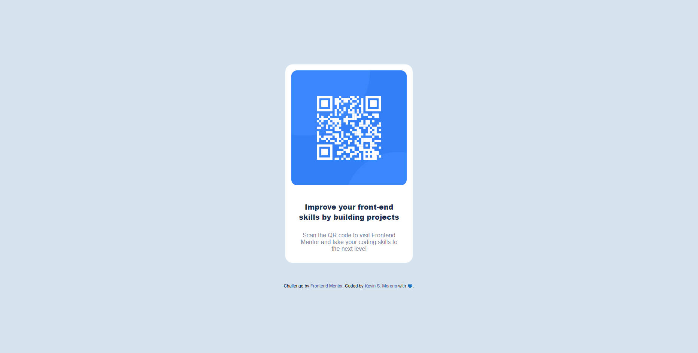

# Frontend Mentor - QR code component solution

This is a solution to the [QR code component challenge on Frontend Mentor](https://www.frontendmentor.io/challenges/qr-code-component-iux_sIO_H). Frontend Mentor challenges help you improve your coding skills by building realistic projects. 

## Table of contents

- [Overview](#overview)
  - [Screenshot](#screenshot)
  - [Links](#links)
- [My process](#my-process)
  - [Built with](#built-with)
  - [What I learned](#what-i-learned)
- [Author](#author)

## Overview

### Screenshot

### Links

- Solution URL: [Frontend mentor solution](https://your-solution-url.com)
- Live Site URL: [Live site at GitHub](https://your-live-site-url.com)

## My process

### Built with

- Semantic HTML5 markup.
- CSS custom properties.
- Flexbox.
- Responsive design.

**Note: These are just examples. Delete this note and replace the list above with your own choices**

### What I learned
To create a card with HTML5 markup and CSS using Flexbox.

## Author

- GitHUB - [Kevin Samuel](https://github.com/ksamueloz)
- Frontend Mentor - [@ksamueloz](https://www.frontendmentor.io/profile/ksamueloz)
